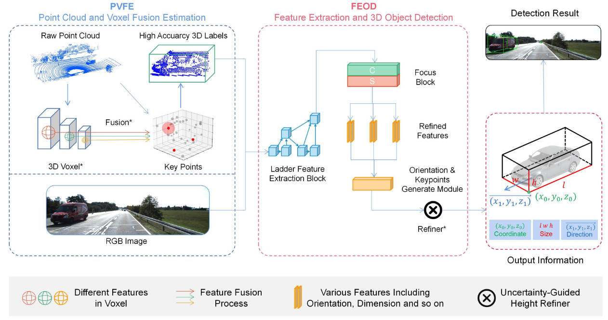

# PVONet

<p align="center">  </p>


## Abstract

LiDAR camera systems are becoming increasingly vital for autonomous driving. The monocular 3Ddetection task is a critical and challenging aspect of this field. However, most algorithms rely solely on manually labeled images, which is a time-consuming and labor-intensive process, and the resulting detection lacks depth information. To address this problem, a semi-supervised 3D object detection model based on LiDAR camera systems:PVONet, is proposed to improve both the detection accuracy and processing time. Firstly, we introduced an innovative data preparation block, PVFE, which utilized LiDAR points to generate 3D Bounding Boxes for unlabeled data,thereby significantly reducing the time associated with manual labeling. Secondly, we presented a new block based on multi-layer transmission for box estimation: FEOD, which is utilized to conduct feature extraction, feature correlation and 3D box estimation on monocular images. Finally, comprehensive experiments conducted on the popular KITTI 3D detection dataset demonstrate that, our PVONet is faster(30 ms on KITTI benchmark) and more accurate[4.69%/3.82%(easy), 4.45%/2.79%(moderate), 4.07%/3.75%(hard) APs increased on 3D/BEV object compared to baseline]. This meets the requirements for high real-time performance in autonomous vehicles applications. The results demonstrate the effectiveness of our model based on LiDAR camera systems.

## Overview

- [Installation](#installation)
- [Getting Started](#getting-started)
- [Pretrained Model](#pretrained-model)
- [Citation](#citation)

## Installation

### Installation Steps

a. Clone this repository.


b. Install the dependent libraries as follows:

* Install the dependent python libraries: 
  
  ```shell
  pip install torch==1.10.0 torchvision==0.11.1 sklearn opencv tqdm
  ```

* We test this repository on Nvidia RTX A6000 GPUs and Ubuntu 18.04.

## Getting Started

### Dataset Preparation

Currently we provide the dataloader of KITTI dataset.
You can download the entire [raw KITTI dataset](http://www.cvlibs.net/datasets/kitti/raw_data.php) by running:

```shell
wget -i ./data/kitti/data_file/kitti_archives_to_download.txt -P kitti_data/
```

Then unzip with

```shell
cd kitti_data
unzip "*.zip"
cd ..
ln -s kitti_data ./data/kitti/raw_data
```


* Please download the official [KITTI 3D object detection](http://www.cvlibs.net/datasets/kitti/eval_object.php?obj_benchmark=3d) dataset and organize the downloaded files as follows:

```
LPCG_PATH
├── data
│   ├── kitti
│   │   │── data_file
│   │   │── raw_data
│   │   │── KITTI3D
|   │   │   │── training
|   │   │   │   ├──calib & velodyne & label_2 & image_2
|   │   │   │── testing
|   │   │   │   ├──calib & velodyne & image_2
├── config
├── high_acc
├── low_cost
├── ...
```

The raw_data refers to the soft link to the raw KITTI dataset.

* You can also choose to link your KITTI dataset path by
  
  ```
  KITTI_DATA_PATH=~/data/kitti_object
  ln -s $KITTI_DATA_PATH/training/ ./data/kitti/KITTI3D/
  ln -s $KITTI_DATA_PATH/testing/ ./data/kitti/KITTI3D/
  ```

* Prepare KITTI raw dataset for training.       
  
  If you use our pre-generated data files, you can skip [prepare_kitti_raw_datafile.py](data/kitti/prepare_kitti_raw_datafile.py).
  
  ```python
  python data/kitti/prepare_kitti_raw_datafile.py
  python data/kitti/link_kitti_raw.py
  ```

### Training & Testing

#### Train a model

##### Step 1: obtain pseudo labels

###### For PVFE mode

Use the pretrained model in OpenPCDet (we use the pre-trained [PV-RCNN](https://drive.google.com/file/d/1sCCDaCuHBJxIeguImCZyEEbi9VDakZa1/view?usp=sharing), you can also use other lidar models as you wanted). Please clone [OpenPCDet](https://github.com/open-mmlab/OpenPCDet) under the high_acc folder and follow their installation guidelines.
Then, generate pseudo labels on KITTI raw data (exclude validation sequences).

```shell
cp high_acc/infer_kitti.py  high_acc/OpenPCDet/tools/
cd high_acc/OpenPCDet/tools
CUDA_VISIBLE_DEVICES=0 python infer_kitti.py --cfg_file cfgs/kitti_models/pv_rcnn.yaml --ckpt ../pv_rcnn_8369.pth --data_path /pvc_user/pengliang/LPCG/data/kitti/kitti_merge/training/velodyne
cd ../../..
```

To ease the usage, we provide pre-generated pseudo labels and converted calibration files (we only converted P2 and Tr_velo_to_cam) [Pseudo-Labels](https://drive.google.com/file/d/1NBfPCb9eE1m5RHgA1ljKD_PdsuiceSN7/view?usp=sharing), [Filtered-Pseudo-Labels](https://drive.google.com/file/d/1plat_KKn0hlYIq6xJl4gJ5FYiQWGc51F/view?usp=sharing) (removed some outliers and only keep cars), [Calibration](https://drive.google.com/file/d/1XAs8I7LJeCcWNGFzAaWAY384fZYfKdL-/view?usp=sharing).
Please note, the ids of pre-generated pseudo labels corresponds to the pre-generated [kitti_raw_name](data/kitti/data_file/split/train_raw.txt) (If you generate this file by yourself ([prepare_kitti_raw_datafile.py](./data/kitti/prepare_kitti_raw_datafile.py) ) , your generated file is different from the provided one because of the np.random.shuffle operation ).


###### Filter pseudo labels and link kitti validation labels

- Filter out empty pseudo labels for training and then link the validation labels. 
  
  If you use our pre-generated [Filtered-Pseudo-Labels](https://drive.google.com/file/d/1plat_KKn0hlYIq6xJl4gJ5FYiQWGc51F/view?usp=sharing) on the high accuracy mode, you can skip [filter_labels.py](tools/filter_labels.py)
  
  ```python
  python tools/filter_labels.py 
  python tools/link_kitti_val_labels.py
  ```

##### Step 2: train monocular models using pseudo labels

###### For FEOD mode

Once you generate these pseudo labels, you can use them to train your model.
We use [M3D-RPN](https://github.com/garrickbrazil/M3D-RPN) and [MonoFlex](https://github.com/Owen-Liuyuxuan/visualDet3D) as the baseline monocular 3D detector.

#### Testing monocular models

Please refer to the corresponding monocular 3D detection codebases you used and then follow their evaluation guidelines (we use[VisualDet3D](https://github.com/Owen-Liuyuxuan/visualDet3D) codebases). 

```shell
cp .visualdDet3D/visualDet3D-master
cd ./make.sh
CUDA_VISIBLE_DEVICES=0 python infer_kitti.py --cfg_file cfgs/kitti_models/pv_rcnn.yaml --ckpt ../pv_rcnn_8369.pth --data_path /pvc_user/pengliang/LPCG/data/kitti/kitti_merge/training/velodyne

# copy mono 3D example config
cd config
cp FEOD FEOD.py

## Modify config path
nano FEOD.py
cd ..

## Compute image database and anchors mean/std
# You can run ./launcher/det_precompute.sh without arguments to see helper documents
./launcher/det_precompute.sh config/FEOD.py train
./launcher/det_precompute.sh config/FEOD.py test # only for upload testing

## train the model with one GPU
# You can run ./launcher/train.sh without arguments to see helper documents
./launcher/train.sh  --config/FEOD.py 0 $experiment_name # validation goes along

## produce validation/test result # we only support single GPU testing
# You can run ./launcher/eval.sh without arguments to see helper documents
./launcher/eval.sh --config/FEOD.py 0 $CHECKPOINT_PATH validation # test on validation split
./launcher/eval.sh --config/FEOD.py 0 $CHECKPOINT_PATH test # test on test split
```
```

## Others

This repository will be cleaned and improved further when I have free time.

## Acknowledgements

The code benefits from [VisualDet3D](https://github.com/Owen-Liuyuxuan/visualDet3D), [OpenPCDet](https://github.com/open-mmlab/OpenPCDet), [Monodepth2](https://github.com/nianticlabs/monodepth2), and [Second](https://github.com/traveller59/second.pytorch). Thanks for their great works!
